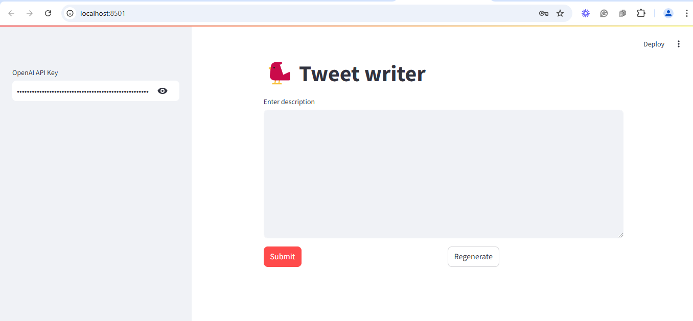
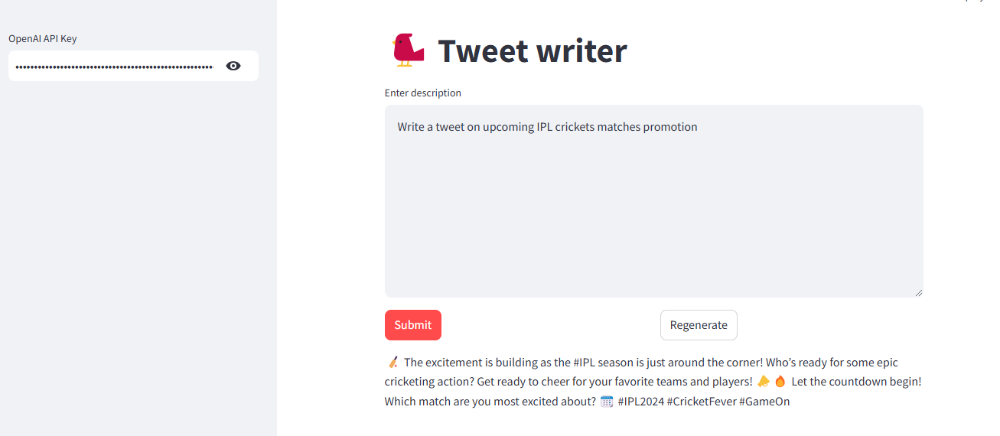

# GenAI Tweet Creator

GenAI Tweet Creator is an AI-powered application that leverages OpenAI's GPT technology to assist users in crafting engaging tweets. Whether you need help writing a new tweet, regenerating variations, or finding inspiration for your next post, this tool has got you covered.

## Features

- **Compose Tweets**: Generate unique and creative tweets based on your input or topic.
- **Regenerate Variations**: Get multiple versions of a tweet to find the perfect wording.
- **User-Friendly Interface**: Simple and intuitive design for seamless tweet creation.

## 📸 Screenshots  

### 1. **Tweet Post Landing**  
  
*Description*: Landing interface to input tweet concept, idea, context to generate post content 

### 2. **Tweet Generated Output**  
  
*Description*: Output generated posts in ready-to-use format.

## Installation

1. Clone the repository:
   ```bash
   git clone https://github.com/your-username/genai-tweet-creator.git
   cd genai-tweet-creator
   ```

2. Install dependencies:
   ```bash
   pip install -r requirements.txt
   ```

3. Set up your OpenAI API key:
   - Obtain an API key from [OpenAI](https://openai.com/api/).
   - Create a `.env` file in the project root directory and add your API key:
     ```env
     OPENAI_API_KEY=your-api-key-here
     ```

4. Run the application:
   ```bash
   python app.py
   ```

## Usage

1. Launch the application and follow the on-screen instructions to generate tweets.
2. Input a topic or idea, and the AI will craft a tweet for you.
3. Use the "Regenerate" feature to create alternative versions of the tweet if desired.

## Example

### Input:
"Tips for staying productive while working remotely"

### Output:
1. "Boost your remote work productivity! 🏠💻
   - Create a dedicated workspace
   - Stick to a daily schedule
   - Take regular breaks
   - Stay connected with your team #WorkFromHome #Productivity"

2. "Remote work hacks: 
   🌟 Set clear goals for the day
   🌟 Minimize distractions
   🌟 Use collaboration tools effectively
   🌟 Don't forget self-care! #RemoteWork"

## Contributing

Contributions are welcome! If you'd like to contribute to the project, please follow these steps:

1. Fork the repository.
2. Create a new branch:
   ```bash
   git checkout -b feature/your-feature-name
   ```
3. Make your changes and commit them:
   ```bash
   git commit -m "Add your commit message"
   ```
4. Push to the branch:
   ```bash
   git push origin feature/your-feature-name
   ```
5. Open a pull request.


## Contact

For questions or feedback, feel free to open an issue or reach out on [GitHub](https://github.com/r123singh/tweetWriter).

---

Happy tweeting! 🎉
